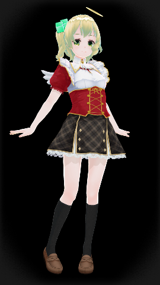
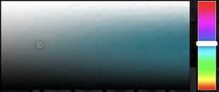
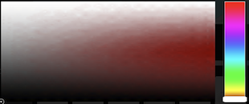

# CC_Erie-Amatsukasa

## これは何？

- [カスタムキャスト](http://customcast.jp/) で作成したキャラクターのパラメータを整理して記載したものです。
- VRMエクスポート機能は実装されていますが、有料かつ１体のみという制限があります。なので、参考情報として設定情報を公開しています。
- カスタムキャストを使って、ここに記載のパラメータ通りにキャラクターをカスタマイズすると、同じ見た目のキャラクターを再現できる、はずです。

## 何の役に立つの？

- 基本的に何の役にも立ちません。
- 自作のキャラクターのパラメータを公開する際、パラメータの書き方を参考にしてもらえればと思ってこのページを作成しました。

----

## キャラクター設定

|属性|内容|
|:---|:---|
|名前|天司　エリー|
|よみがな|あまつかさ　えりー|

## サンプルイメージ

（画像サイズ大きめなので表示時には注意ください）

- [サンプル１](sample/ErieAmatsukasa_001.png) 
- [サンプル２](sample/ErieAmatsukasa_002.png) 
- [サンプル３](sample/ErieAmatsukasa_003.png) 
- [サンプル４](sample/ErieAmatsukasa_004.png) 
- [サンプル５](sample/ErieAmatsukasa_005.jpg) 
- [サンプル６](sample/ErieAmatsukasa_006.jpg) 

----

## ボディ設定

### ボディパーツ

|パーツ|パーツ名|サイズ|課金|
|:---|:---|---:|:---:|
|ボディ  |ボディA|-|Free|
|フェイス|プリティフェイス・ノーマル|-|Free|
|肌     |通常肌|-|Free|
|前髪    |アシメロール|0, 0|Free|
|後髪    |ウェーブショート|0|Free|
|もみあげ|-|-|-|
|テール  |ショートロール・R|0.81|Free|
|アホ毛  |-|-|-|
|眉毛    |ライトシャープまゆ|-|Free|
|瞳      |マイルド|-|Free|
|ハイライト|ブライト|-|Free|
|ほくろ  |-|-|-|
|タトゥー|-|-|-|
|ネイル  |グラデーションネイル・薄橙|-|Free|
|リップ  |グロス|-|Free|
|キバ    |-|-|-|

### ボディパラメータ

|パラメータ|値|
|:---|---:|
|顔の輪郭    |51|
|顔の横幅    |47|
|顔の縦幅    |59|
|眉の上下    |31|
|目の横幅    |78|
|目の縦幅    |54|
|目の横移動  |28|
|目の縦移動  |0|
|目の閉じ具合|0|
|眼球の上下  |27|
|眼球の横幅  |67|
|眼球の縦幅  |30|
|身長       |0|
|足の長さ    |57|
|胸のサイズ  |16|
|胸のたれ具合|16|
|胸上下      |74|
|胸寄り      |9|
|ウェスト    |68|
|お腹        |44|
|首の長さ    |66|
|肩幅        |23|
|腕の太さ    |0|
|腕の長さ    |74|
|ヒップ      |48|
|足の太さ    |0|
|足の太さ２  |0|

----

## ドレス設定

### ドレスパーツ

|パーツ|パーツ名|色|サイズ|課金|
|:---|:---|:---|---:|:---:|
|帽子      |天使の輪|ノーマル|0.71|Free|
|ヘッドセット|-|-|-|-|
|上半身    |ノワールメイドウェア|赤|-|Free|
|下半身    |ダンスアイドルスカート|黒|-|Free|
|ワンピース|-|-|-|-|
|水着      |-|-|-|-|
|靴下      |スクールソックス|黒|-|Free|
|靴        |ローファー|濃茶|-|Free|
|髪飾り    |-|-|-|-|
|メガネ    |-|-|-|-|
|アイマスク|-|-|-|-|
|鼻飾り    |-|-|-|-|
|耳飾り    |-|-|-|-|
|手袋      |-|-|-|-|
|首飾り    |-|-|-|-|
|首輪      |-|-|-|-|
|髪留め    |ブロック髪留め|緑|1.59|Free|
|腕飾り    |-|-|-|-|
|腹飾り    |-|-|-|-|
|足飾り    |-|-|-|-|
|尻尾      |-|-|-|-|
|翼        |天使の羽・プリティ|ノーマル|-|Free|

----

## カラー設定

### 肌カラー

#### 基本色

|パラメータ|値|
|:---|---:|
|対照|71|
|影率|68|

#### 影色

|パラメータ|値|
|:---|---:|
|対照|132|
|影率|68|

#### 境界色

|パラメータ|値|
|:---|---:|
|対照|28|

### 髪カラー

#### 基本色

|パラメータ|値|
|:---|---:|
|対照|85|
|影率|195|

#### 影色

|パラメータ|値|
|:---|---:|
|対照|92|
|影率|195|

#### 境界色

|パラメータ|値|
|:---|---:|
|対照|84|

### 眉カラー

#### 基本色

|パラメータ|値|
|:---|---:|
|対照|0|
|影率|0|

#### 影色

|パラメータ|値|
|:---|---:|
|対照|0|
|影率|0|

### 瞳カラー

#### 基本色

|パラメータ|値|
|:---|---:|
|対照|83|
|影率|158|

#### 影色

|パラメータ|値|
|:---|---:|
|対照|123|
|影率|158|

enjoy!

----

- 『カスタムキャスト』は株式会社ドワンゴの登録商標です。

